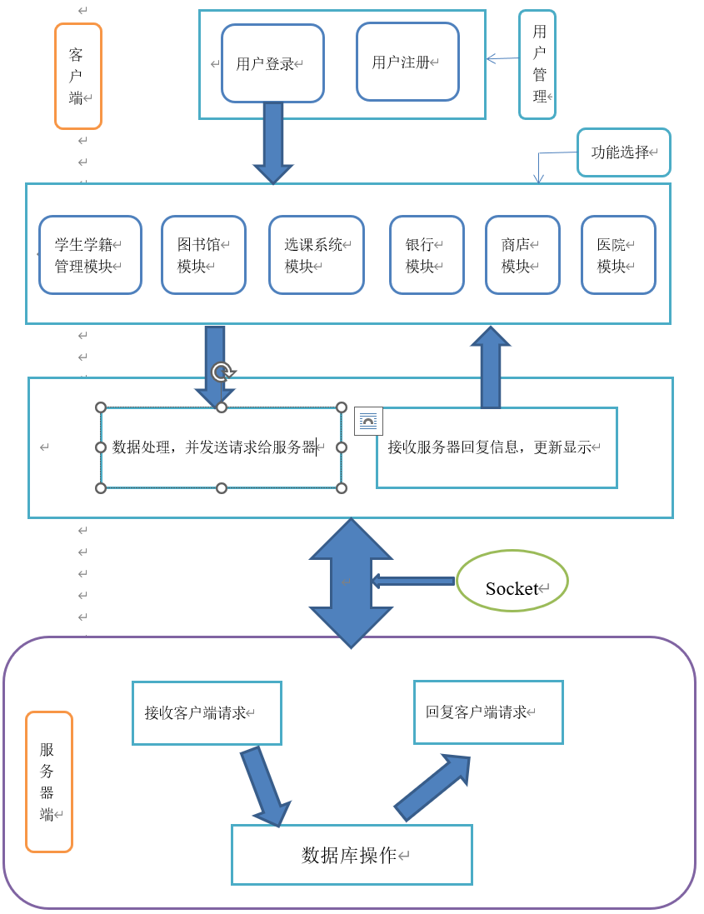

# Vcampus

## 中文

#### 介绍

虚拟校园系统

#### 背景
这个项目是暑期学校的一个实用软件项目，由我们小组合作开发和实施。我们设想的虚拟校园系统是为某大学的教师、学生和管理人员群体提供的一个在线校园管理系统。在全球信息技术如此快速发展的背景下，师生们迫切需要一个方便、快捷、高效、强大的校园管理系统来管理学生信息、生活服务和学术信息。管理系统的虚拟化、信息化、网络化可以极大地提高工作效率，提供更安全、更友好的管理模式。这是校园现代化建设的一个非常重要的步骤。

#### 开发环境

1.  Eclipse
2.  JDK 16.0.1
3.  MySql

#### 功能需求
虚拟校园系统用户主体是学生和教师，管理员则具有直接修改数据库的权限。下列是对各个使用主体的具体需求分析：
1.  学生需求：选课和成绩查询，向老师提交作业文件，图书馆书籍查询、借阅和续借，网上商店商品浏览和购买和个人基本信息查询和更新；
2.  教师需求：课程和成绩信息添加和修改，从学生处获得作业并批改写评语，图书馆书籍查询、借阅和续借，网上商店浏览和购买和学生基本信息查询；
3.  管理员需求：作为整个系统的超级管理员，课程和成绩信息查询修改，图书馆信息查询和修改，商店商品信息查询修改和学生信息查询修改等对有数据库的增删改查操作，拥有最高权限。

#### 软件架构
软件架构说明

#### 功能及界面

__学籍管理模块:__

__选课模块:__

__选课模块-教务管理员端:__

__作业模块-学生端:__

__在线聊天1:__

__在线聊天2:__

## English

#### Introduction

Virtual Campus Systems

#### Background
This project was a practical software project for summer school and was developed and implemented collaboratively by our group. The virtual campus system we envisioned was an online campus management system for the faculty, student and administrator community of a university. In the context of such a rapid development of global information technology, students and teachers are in urgent need of a convenient, fast, efficient and robust campus management system to manage student information, life services and academic information. The virtualization, informatization and networking of the management system can greatly improve efficiency and provide a more secure and friendly management mode. This is a very important step in the modernization of the campus.

#### Development Environment

1.  Eclipse
2.  JDK 16.0.1
3.  MySql

#### Functional Requirements
The main users of the virtual campus system are students and teachers, while the administrator has the authority to modify the database directly. The following is an analysis of the specific requirements of each user entity.
1.  students' needs: course selection and grade inquiry, submission of assignment documents to teachers, library book inquiry, borrowing and renewal, online store product browsing and purchase and personal basic information inquiry and update.
2.  teachers' needs: adding and modifying course and grade information, obtaining assignments from students and correcting and writing comments on them, library book inquiries, borrowing and renewing, online store browsing and purchasing and basic student information inquiries.
3.  administrator requirements: as the super administrator of the whole system, course and grade information query and modification, library information query and modification, store product information query and modification and student information query and modification, etc. have the highest authority to add, delete and modify operations on the database.

#### Software Architecture

#### Function and Interface

__Academic Registration Module:__

__Course Selection Module:__

__Course selection module-administrative side:__

__Assignment Module - Student Side:__

__Live Chat 1:__

__Live Chat 2:__

